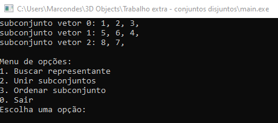

# Introdução

Os algoritmos contidos no presente repositório referem-se a um projeto prático de fixação proposto pelo professor Carlos vinícius como componente avaliativo extra da disciplina de algoritmos e estruturas de dados II ministrada na turma 2024.1 do curso de ciência da computação da UFCA. 

O mesmo consiste em uma representação de conjuntos disjuntos e suas funcionalidades associadas de encontrar representante de um elemento, e unir subconjuntos a partir da passagem de dois elementos contidos em subcojuntos distintos, além disso, também é possível ordenar um subconjunto, seja este originado da partição passada no arquivo de entrada, ou derivado das operações de união durante a execução do programa, utilizando os algoritmos de ordenação clássicos (bubbleSort, insertionSort, quickSort e mergeSort).

# Formato padrão do arquivo de entrada
O formato padrão para especificação das informações gerais do conjunto e os seus respectivos subconjuntos definidos pela partição foi definido da seguinte forma:

<ul>
    <li> 1° linha: informações gerais do conjunto:</li>
    <ul>
        <li>quantidade de elementos do conjunto,quantidade de subconjuntos</li>
    </ul>
    <li>2° linha em diante: elementos constituintes de cada subconjunto</li>
    <ul>
        <li>1° elemento,2°elemento...</li>
    </ul>
</ul>

### Exemplo válido de entrada:

>8,3  
1,2,3  
5,6,4  
8,7  

# Esturutura e composição do projeto

- `bubbleSort.h:` implementação do algoritmo de ordenação bubbleSort, que efetua a troca de elementos de um subconjunto baseado na comparação do elemento atual com o elemento da posição seguinte
- `insertionSort.h:` implementação do algoritmo de ordenação insertionSort, que realiza a troca de elementos de um subconjunto a partir da comparação dos elementos da posição atual(elemChave) com os das posições anteriores, copiandos para a direita se elemChave for menor que os elementos das posições anteriores ao mesmo
- `quickSort.h:` implementação do algoritmo de ordenação quickSort, que realiza a troca de elementos de um subconjunto a partir da escolha de um pivo, onde os elementos menores que o valor de pivo são copiados a esquerda, enquanto os maiores a sua direita
- `mergeSort.h:` implementação do algoritmo de ordenação mergeSort, que realiza a troca de elementos de um subconjunto a partir de divisões sucessivas do mesmo pela metada, e respectiva reconstrução ordeanda a partir da copia para o vetor original dos menores elementos entre ambas as metades.
- `Main.c:` componente principal do código que contém instruções de obtenção dos dados extraídos do arquivo de entrada, tratamento e manipulação em memória das informações obtidas, exibição e controle do menu de usuário e toda a lógica de retorno de um representante, união de subconjuntos e chamada das funções de ordenação baseada na opção escolhida pelo usuário

# funções nativas utilizadas
- função fgets de <stdio.h>: para obteção individual das linhas do arquivo de entrada
- função strtok de <string.h>: para tokenização e obtenção das cadeias de string almejadas através da procura por delimitadores
- função atoi de <stdlib.h>: para converter caracteres obtidos das linhas para inteiro
- funções de manipulação de memória como malloc e realloc de <stdlib.h>: para alocação e aumento de memória reservada as instâncias de struct's e vetores *char reservado ao armazenamento das linhas
- função fprintf de <stdio.h>: para impressão dos dados gerados no arquivo de saída txt

# Instruções de execução

### Instruções para Executar o Arquivo `main.c`

1. **Baixar o Repositório**  
   - Clique no botão verde **"Code"** na página principal do repositório.  
   - Selecione a opção **"Download ZIP"** e salve o arquivo em seu computador.  

2. **Extrair os Arquivos**  
   - Localize o arquivo ZIP baixado e extraia seu conteúdo para uma pasta de sua preferência.  

3. **Abrir o Arquivo `main.c`**  
   - Abra sua IDE de preferência (ex.: Dev-C++, Code::Blocks, ou outra compatível com C).  
   - Na IDE, navegue até a pasta onde você extraiu os arquivos e abra o arquivo `main.c`.  

4. **Compilar e Executar o Programa**  
   - Certifique-se de que o compilador C está configurado corretamente na sua IDE.  
   - Clique no botão **"Compile and Run"** (ou equivalente na sua IDE).  

5. **Escolher opções do menu de usuário**  

    
    - Após a abertura do terminal escolha(digite) a opção desejada entre as listadas pelo menu de usuário, o programa irá exibir a saída correspondente no próprio terminal e exibirá novamente o menu caso eventualmente o usuário deseje executar outras opções.
    - Para finalizar o programa selecione a opção correspondente "0" para sair.

